# Verification & Validation Plan

This document is the V&V plan for the commavq compressor. It is split into a
**design phase** (specification review, no code execution) and an
**implementation phase** (executable tests run against the real code).

---

## Phase 1 — Design Verification (review-only)

Goal: confirm the test plan, architecture, constraints, and interface
contracts are internally consistent *before* any tests are executed.

Deliverable: a checklist of PASS / FAIL / FLAG entries recorded in
[docs/vv_design_review.md](vv_design_review.md) once the review is performed.

### 1.1 Decoder forward-pass pipeline ordering

Review [utils/vqvae.py:302-334](../utils/vqvae.py#L302-L334) (`Decoder.forward`)
and confirm the pipeline executes in this order:

1. `quantize.decode(encoding_indices)` — `(B, 128)` int IDs → `(B, 128, 256)` embeddings
2. `rearrange('b (h w) c -> b c h w', w=quantized_resolution)` → `(B, 256, 8, 16)`
3. `post_quant_conv` (1x1 Conv2d, 256→256)
4. `conv_in` (3x3 Conv2d, 256→512)
5. Mid stack: `mid.block_1` → `mid.attn_1` → `mid.block_2`
6. Four `Upsample` stages, one per `i_level` in `{4, 3, 2, 1}` (no upsample at `i_level=0`)
7. `norm_out` → `nonlinearity (swish)` → `conv_out` (3x3 Conv2d, 128→3)
8. Output scaling: `((h + 1.0) / 2.0) * 255.`

### 1.1.1 Pipeline diagram

```mermaid
flowchart TD
    A["encoding_indices (B, 128) int64"]
    B["quantize.decode<br/>→ (B, 128, 256)"]
    C["rearrange 'b (h w) c → b c h w', w=16<br/>→ (B, 256, 8, 16)"]
    D["post_quant_conv: Conv2d 1×1, 256→256"]
    E["conv_in: Conv2d 3×3, 256→512<br/>→ (B, 512, 8, 16)"]
    F["mid.block_1: ResnetBlock 512→512"]
    G["mid.attn_1: AttnBlock 512"]
    H["mid.block_2: ResnetBlock 512→512"]
    I["up[4]: 3× (ResnetBlock 512→512 + AttnBlock@res=16)<br/>then Upsample ×2 → (B, 512, 16, 32)"]
    J["up[3]: ResnetBlock 512→256, 256→256, 256→256<br/>then Upsample ×2 → (B, 256, 32, 64)"]
    K["up[2]: 3× ResnetBlock 256→256<br/>then Upsample ×2 → (B, 256, 64, 128)"]
    L["up[1]: ResnetBlock 256→128, 128→128, 128→128<br/>then Upsample ×2 → (B, 128, 128, 256)"]
    M["up[0]: 3× ResnetBlock 128→128<br/>(no upsample)"]
    N["norm_out: GroupNorm(32)"]
    O["nonlinearity: swish (x · σ(x))"]
    P["conv_out: Conv2d 3×3, 128→3<br/>→ (B, 3, 128, 256) float"]
    Q["scale: ((h + 1.0) / 2.0) × 255"]
    R["RGB image (B, 3, 128, 256)"]

    A --> B --> C --> D --> E --> F --> G --> H
    H --> I --> J --> K --> L --> M
    M --> N --> O --> P --> Q --> R
```



Each `Upsample` block expands `(H, W) -> (2H, 2W)` via
`F.interpolate(mode="nearest")` followed by a stride-1 3x3 Conv2d that
preserves channels. The four upsamples take `8x16 -> 16x32 -> 32x64 ->
64x128 -> 128x256`.

### 1.2 Shape algebra

Walk the dimensions through the pipeline and confirm:

| Stage                              | Shape              |
| ---------------------------------- | ------------------ |
| input encoding indices             | `(B, 128)`         |
| after `quantize.decode`            | `(B, 128, 256)`    |
| after `rearrange` (w=16)           | `(B, 256, 8, 16)`  |
| after `post_quant_conv` / `conv_in`| `(B, 512, 8, 16)`  |
| after upsample x1                  | `(B, *, 16, 32)`   |
| after upsample x2                  | `(B, *, 32, 64)`   |
| after upsample x3                  | `(B, *, 64, 128)`  |
| after upsample x4                  | `(B, *, 128, 256)` |
| after `conv_out` + scale           | `(B, 3, 128, 256)` |

### 1.3 `Upsample` contract

Review [utils/vqvae.py:36-42](../utils/vqvae.py#L36-L42) and confirm:

- Spatial dims double via `F.interpolate(scale_factor=2.0, mode="nearest")`.
- Channels unchanged (`in_channels == out_channels`).
- Followed by a stride-1 3x3 Conv2d with padding=1 (shape-preserving).

### 1.4 `video.py` contracts

Review [utils/video.py](../utils/video.py) and confirm:

- `read_video` ([utils/video.py:17-27](../utils/video.py#L17-L27)) converts
  OpenCV's native BGR to RGB via `cv2.COLOR_BGR2RGB`.
- `write_video` ([utils/video.py:9-15](../utils/video.py#L9-L15)) inverts that
  with `frame[...,::-1]` so the OpenCV writer receives BGR again.
- `transpose_and_clip` ([utils/video.py:29-33](../utils/video.py#L29-L33))
  reorders `(B, C, H, W) → (B, H, W, C)` and clips to `uint8 [0, 255]`.
- `transform_img` ([utils/video.py:35-40](../utils/video.py#L35-L40))
  produces a `(128, 256, 3)` array regardless of input aspect ratio
  (cv2 `OUTPUT_SIZE` is `(W=256, H=128)` so the resulting numpy array is
  `(H=128, W=256, 3)`).

---

## Phase 2 — Implementation Validation (executable tests)

Goal: execute tests against the running code to validate the contracts that
the design review verified on paper.

### 2.1 Layout

```
tests/
  conftest.py
  test_decoder_forward.py
  test_upsample.py
  test_video_utils.py
  test_roundtrip_ssim.py
requirements-dev.txt
```

Run test
```
pip install pytest scikit-image
pytest tests/test_roundtrip_ssim.py -m slow -v
```

`tests/conftest.py` provides:

- A `CompressorConfig` fixture (real default config).
- A fresh `Decoder` fixture with random weights so unit tests run without
  downloading the checkpoint.
- A fixed `torch.manual_seed` for reproducibility.

### 2.2 `test_decoder_forward.py`

- **`test_decoder_output_shape`** — feed
  `torch.randint(0, vocab_size, (B, 128))` and assert output shape is
  `(B, 3, 128, 256)`.
- **`test_decoder_output_range`** — assert that after passing the raw decoder
  output through `transpose_and_clip`, all values are in `[0, 255]` and
  dtype is `uint8`. (Raw float output may overshoot with random weights;
  the production path always goes through clipping.)
- **`test_decoder_intermediate_z_shape`** — run a forward pass and assert
  `decoder.last_z_shape == (B, 256, 8, 16)`.

### 2.3 `test_upsample.py`

- **`test_upsample_doubles_spatial`** — `Upsample(C)` on `(2, C, 4, 4)` returns
  `(2, C, 8, 8)`; channel count unchanged.
- **`test_upsample_nearest_neighbor`** — replace the inner conv with
  `nn.Identity` (or set its weights to a centered impulse) and assert
  `out[..., 2i, 2j] == in[..., i, j]` for all `i, j` and that each input
  pixel is replicated to its 2x2 output block.

### 2.4 `test_video_utils.py`

- **`test_transform_img_shape`** — feed several aspect ratios
  (e.g. `(874, 1164, 3)`, `(720, 1280, 3)`, `(1080, 1920, 3)`) and assert
  output shape is `(128, 256, 3)` in every case.
- **`test_transpose_and_clip`** — input `(B, 3, H, W)` float array containing
  values `< 0` and `> 255`; assert output shape `(B, H, W, 3)`, dtype
  `uint8`, and `min >= 0`, `max <= 255`.
- **`test_read_write_video_color_roundtrip`** — write a small synthetic RGB
  clip with `write_video`, read it back with `read_video`, and assert
  per-channel mean is preserved within a loose tolerance (the codec is
  lossy). This validates that the BGR↔RGB inversion in `write_video` is
  the correct inverse of the conversion in `read_video`.

### 2.5 `test_roundtrip_ssim.py` (marked `@pytest.mark.slow`)

End-to-end encode→decode round trip on known driving frames.

- Skip if `skimage` is unavailable or if the checkpoint cannot be downloaded.
- Load real `Encoder` and `Decoder` via `load_state_dict_from_url`.
- Use a small set of known frames (sourced from `examples/` or a small
  fixture) processed by `transform_img`.
- Encode → decode → `transpose_and_clip` → SSIM via
  `skimage.metrics.structural_similarity` per frame.
- Assert `mean(SSIM) >= THRESHOLD`. Initial threshold: **0.6** (placeholder),
  to be tightened after a first measurement on real frames. The threshold is
  intentionally loose because the compressor is lossy by design.

### 2.6 Test dependencies

Add `requirements-dev.txt`:

```
pytest
scikit-image
```

Run:

```
pytest tests/ -q              # fast unit tests only
pytest tests/ -q -m slow      # include the round-trip SSIM test
```

---

## Open items to resolve before/while implementing

1. **Row-major vs col-major wording** — the spec says "col-major"; the code is
   row-major (einops). Tests will assert the code's actual behavior and the
   design review will flag the wording mismatch.
2. **SSIM threshold** — committed at `0.6` initially; re-tune after the first
   real measurement.
3. **Network access for the round-trip test** — gated behind
   `pytest.mark.slow` and a `skipif` when the checkpoint download fails.
